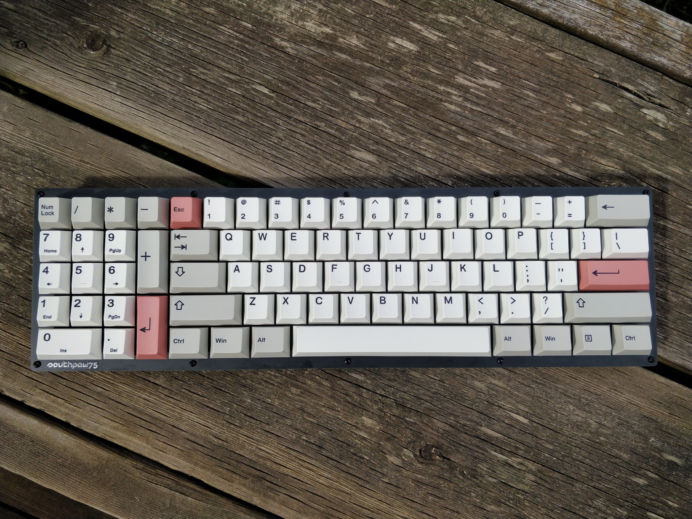
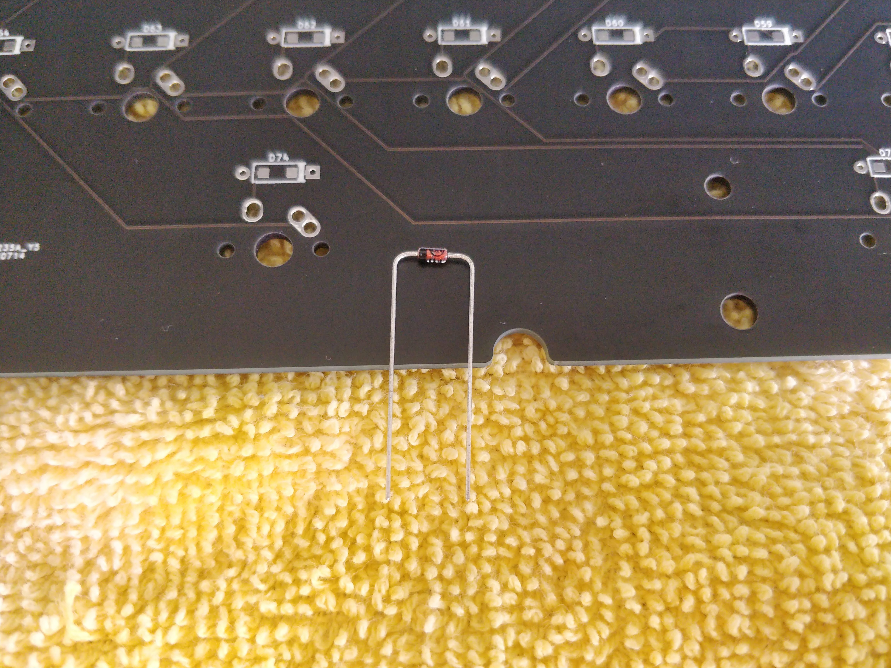
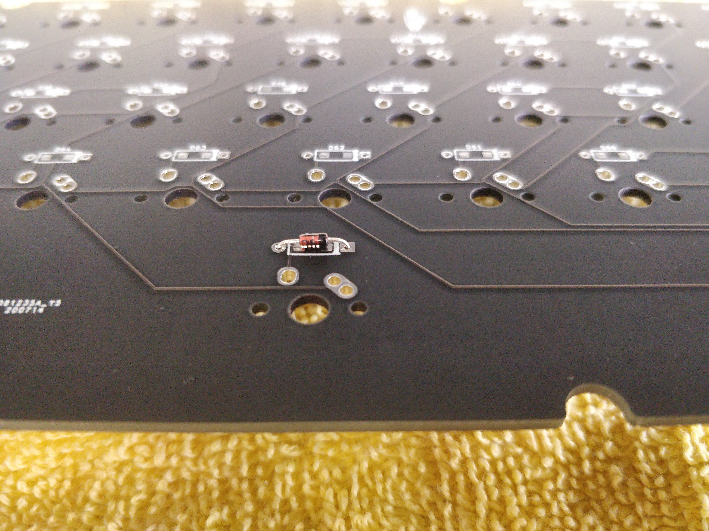
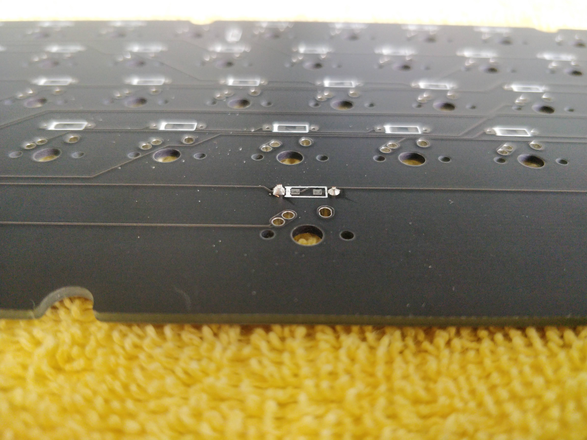
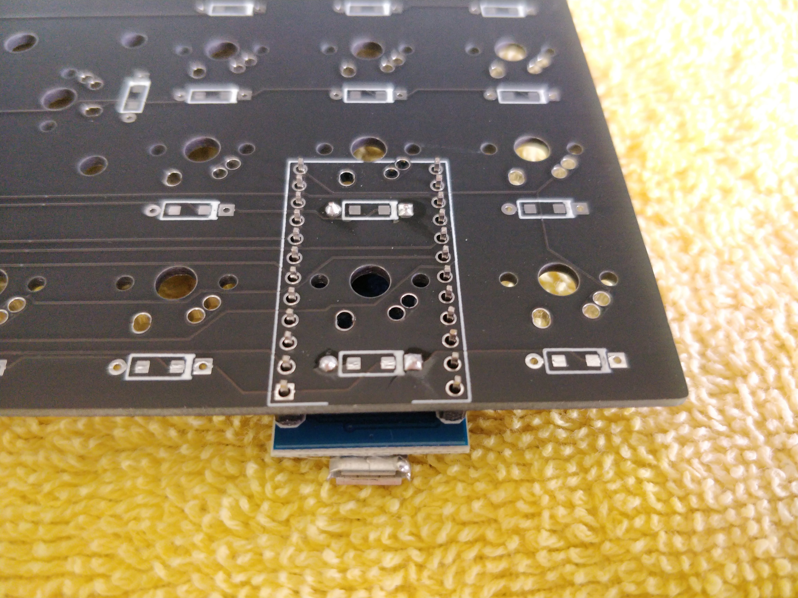
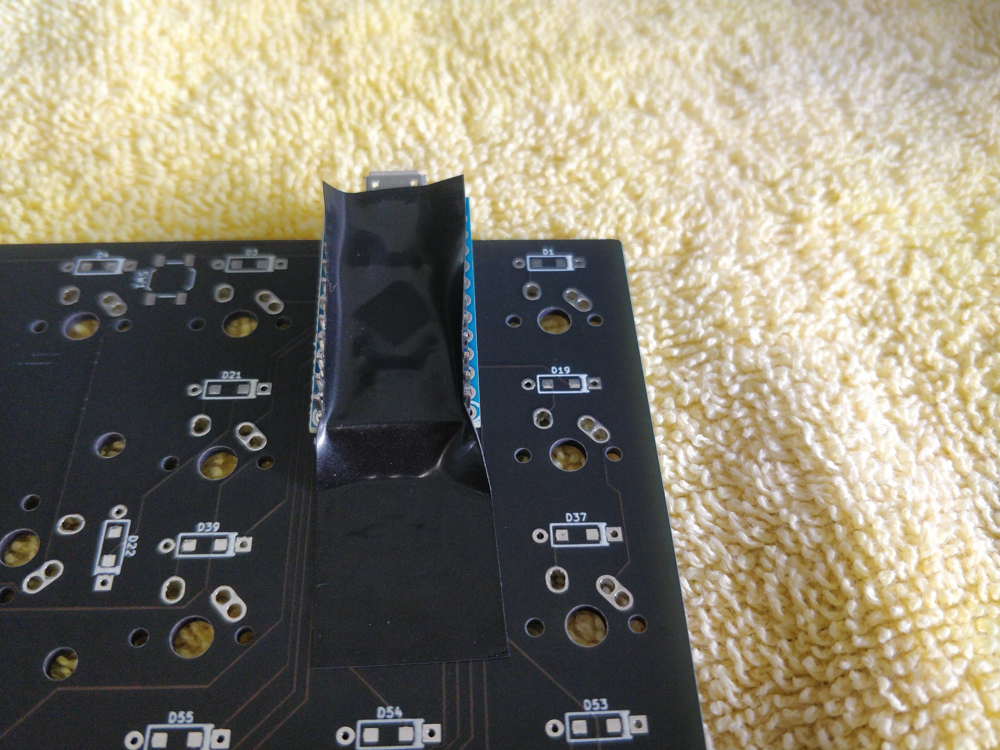
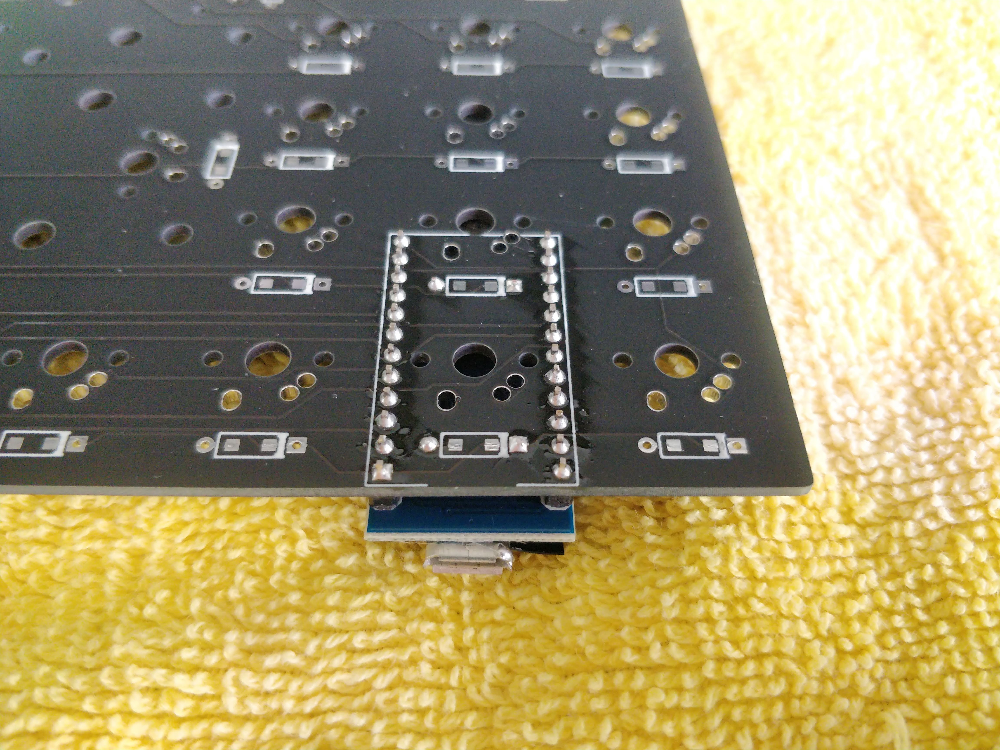
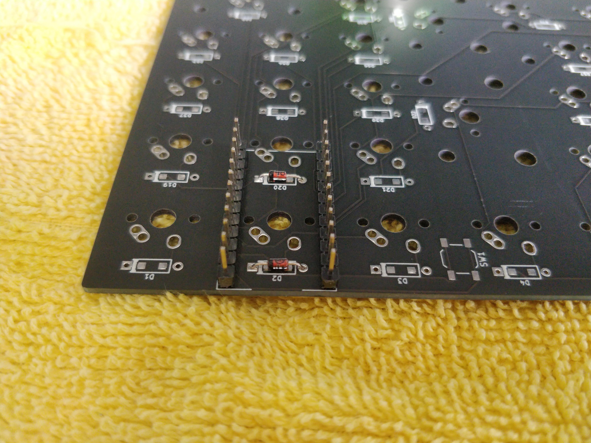
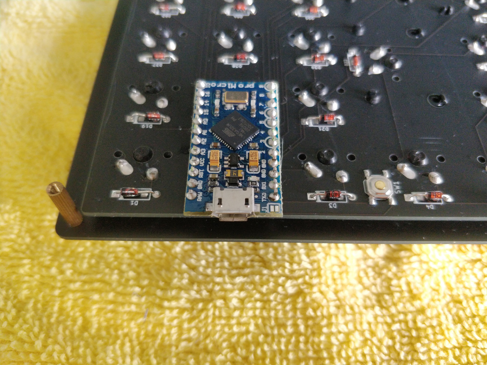

# Southpaw75

The Southpaw75 is a budget FR4 keyboard designed to make a southpaw-style layout available to everyone with as few compromises as possible.



If you have any questions or need help, please contact me on Discord: **Volvo B5234T#0733**

### Disclaimer: You must follow this guide in the order it is written. Assembling stuff in the wrong order (specifically your Pro Micro or Elite C and its headers) will likely result in you having to desolder components and significantly increase the amount of time it takes to assemble. I am not responsible for boards damaged during assembly.

# Assembly:
### 1. Bend the legs of all your diodes so they look like this:

### 2. Put the diodes through the PCB so the legs stick out the front side of the board and so the diode is flush with the back, making sure the black line on the diode faces the square pad:

### 3. Solder from the back and snip the legs:

### 4. Repeat for all diodes (you will have to solder 78, and you will have several extras)
### 5. Solder your reset button to the PCB (use tweezers to hold it down, as the metal will conduct heat from your iron and burn your finger)
### 6. Place your Pro Micro or Elite C onto its pin headers and sit it into the board so the Pro Micro is on the back of the PCB (the side with the Southpaw logo) and tape it down to temporarily hold it in place. This helps align the pin headers properly. **DO NOT SOLDER THE PRO MICRO OR ELITE C TO THE PIN HEADERS YET!**


### 7. Solder in the pin headers from the front side of the PCB. **Do not solder the Pro Micro or Elite C yet, just the headers!**


### 8. Attach your stabs to the PCB (some PCB stabs might be a tight fit with the plate; do not be afraid to push, you won't break it)
### 9. Mount switches in the corner of the plate to align it, then lower the plate onto the PCB
### 10. Add the rest of your switches and solder them all in
### 11. Once you have verified that all your diodes, switches, and Pro Micro or Elite C pin headers are soldered properly, you can now solder your Pro Micro or Elite C onto the pin headers:

### 12. Attach standoffs to the bottom of the plate using screws from the other side
### 13. Screw on the bottom plate
# Flashing instructions for Linux:
### 1. Plug your Pro Micro or Elite C in
### 2. Open up the [QMK configurator](https://config.qmk.fm/#/southpaw75/LAYOUT) and create your desired layout
### 3. Download the .json file (on the left, next to keymap.json)
### 4. Open up a command line
### 5. Type ```qmk flash /path/to/layout.json``` (obviously replacing the file path with the path to your downloaded layout) and follow any additional instructions
### One thing to note is that you can compile a .hex file on the configurator and flash that with avrdude, however, I prefer the method outlined above.
# Flashing instructions for Windows:
### Please keep in mind that I do not run Windows on my own system and cannot 100% verify this flashing procedure will work or if it requires any other configuration. I highly recommend you check the QMK docs if something is not working. I am unable to help with any flashing problems if you run Windows.
### 1. Plug your Pro Micro or Elite C in
### 2. Open up the [QMK configurator](https://config.qmk.fm/#/southpaw75/LAYOUT) and create your desired layout
### 3. Click "compile" in the upper right, and once it's done, download the .hex by clicking "firmware"
### 4. Open up QMK toolbox and load your downloaded .hex
### 5. Click "flash" and follow any additional instructions
